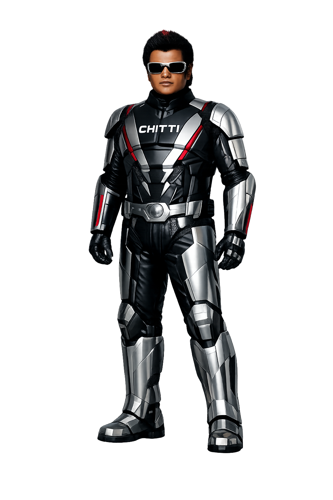

# Chitti 3.0

Home assistant with super powers named after the infamous [Tamil movie character](https://www.youtube.com/watch?v=5OkypaWGYAo&list=RD5OkypaWGYAo).

Built for educational STEM and AI Engineering purposes for edge AI enthusiasts.

## Hardware

- Nvidia Jetson Nano
- USB Camera
- USB Mic
- USB Speaker

## Software

- llama.cpp + CUDA (backend)
- portaudio19-dev
- python dependencies in requirements.txt

## Pre-trained AI Models

- Kokoro TTS
- Whishper (Open AI)
- Qwen3 VL (Qwen / Alibaba Group)

## Fine-tuned AI Models

- Wakeword detection (for the phrase "Hey Chitti")

## Application Pipeline

Wakeword ➔ Listen ➔ Audio In ➔ Whisper ➔ Prompt/Video Embeddings ➔ Qwen3 VL ➔ Kokoro TTS ➔ Audio Out

#### Copyrights and Licencing

This repository uses MIT licence. 

Any reuse of the code is allowed as long as s the original copyright notice is included.
